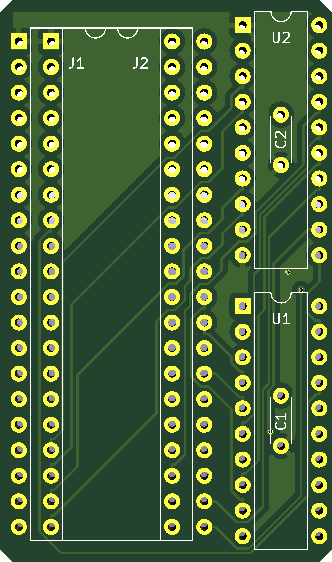

# Apple //e IOU IOU Prosthetic Speaker Board

## Introduction

**NOTE:** While I'm pretty sure my prototype works and is wired like the schematics you find in this project, I've yet to receive the PCBs from the producers and test them. I will remove this warning once I'll be able to test one.

While the original Apple ][ computers where completely built out of off-the-shelf integrated circuits, the newer "enhanced" units (//e, ][e) used custom ICs (IOU and MMU) to replace a lot of the old logic. This was done both as a cost cutting measure and as a way to hinder the creation of clones.

A side effect is that these custom ICs are nowadays almost impossible to obtain, and if one of them dies, you're left short of an Apple //e.

During the repair of a //e, I noticed that all the self-tests were passing, but there was no audible beep coming from the speaker. After investigating the source of the Issue, I found out that the speaker was driven by the `SPKR` signal coming from PIN 8 of the IOU, and that pin was only producing noise.

Instead of scrapping the board for parts, I decided to reimplement the logic in the IOU that triggers the speaker: a flip-flop that pilots an open-collector output and gets clocked when when the CPU accesses address `$C03x`.

### How does it work

This board gets sandwiched between the IOU and the motherboard, it leeches the signals required to decode the `SPKR` signal and then feeds it back to the mainboard. The pin 8 of the IOU that provided the original signal becomes isolated.

U2 (74LS373) is used to latch the addresses A3, A4 and A7, effectively demultiplexing them.

U1 provides the following functions: It implements the latch signal that gets fed into U2 so it can demultiplex the address lines, it implements a flip flop that gets triggered when an address in range `$C03x` gets accessed, and finally it implements an OC output enabled or disabled by the flip-flop, that will be used to pull low the speaker line.

## BOM

- 2x rows of 20-pin male headers turned pins
- 1x 40-pin wide socket
- 1x 74LS373 (U2)
- 1x GAL16V8 (U1)
- 2x 100nF ceramic capacitors

With the top of the board facing you, the male headers must be installed in the 1st and 3rd column, with the pins facing the underside of the board, so they can be inserted into a socket in the mainboard.

Remember to flash the JED file to the GAL16V8!
